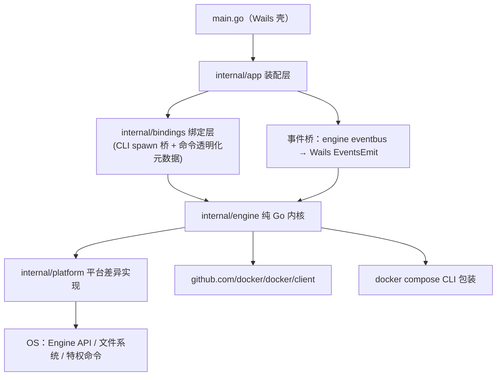

# phpbox Desktop · 最终设计方案（全量技术版）

- **状态**：Approved · v2.0（全量自包含版，开工唯一依据）
- **日期**：2026-09-13
- **关联**：Annex A = `adr-001-desktop-tech-stack.md`（决策过程记录）；Annex B = `desktop-ui-spec-v2.md`（交互规格裁决日志）。本文为全量整合版，日常开发只读本文即可。

---

## 0. 定案记录（2026-09-13，用户拍板）

| 决策 | 定案 | 影响 |
| --- | --- | --- |
| 产品定位 | **开源工具**（MIT），自用优先、可公开发布 | README 双语、LICENSE、安装前置文档必备；签名/自动更新推迟 |
| 语言 | 中文默认 + en-US 必须完整（规约 §11.1） | en 文案由 AI 出初稿 |
| bash 引擎角色 | **冻结为参考实现**：只修致命缺陷；桌面版唯一演进线；parity 对拍=迁移验收 | bash 仓 README 已注记 |
| v0.1 服务线范围 | PHP + MySQL + Nginx 三线打样（黄金路径）；pgsql/redis/go 随后 | 决定 M0.5 交付顺序 |
| 仓库 | 新仓 `~/phpbox-desktop`（module `github.com/xiaokentrl/phpbox-desktop`），MIT；设计文档随迁 | bash 仓保留为 CLI 参考与 parity 基准 |

## 1. 项目定位

把 phpbox（纯 Bash 的本地 Docker 多版本开发环境管理器：PHP/MySQL/PostgreSQL/Redis/Nginx/Go + 站点 + 离线缓存 + 备份）升级为跨平台桌面应用。bash CLI 保留为高级用户入口与过渡期引擎。

**用户时刻模型**（一切设计的锚点）：

| 时刻 | 频率 | 代表动作 |
| --- | --- | --- |
| A 日常巡检 | 每天多次 | 看服务健康、取连接信息/密码、看日志 |
| B 环境变更 | 每周 | 装版本/扩展/站点、版本试水切换 |
| C 运维处置 | 偶发但紧急 | 故障诊断、磁盘治理、备份迁移 |

**差异化卖点（UI 必须显性化）**：离线缓存（`offline/` 命中即零网络安装）、真实踩坑经验产品化（已知故障模式一键修复）、多版本并行 + 秒切。

**非目标**：生产部署/高可用；多机远程编排（远期）；容器运行时替代品；修改用户项目源码。

---

## 2. 技术栈定案

| 决策项 | 定案 | 细节 |
| --- | --- | --- |
| 引擎语言 | **Go 1.27.x**（最新稳定版，2026-08 发布） | 策略=跟随最新稳定版；CI 矩阵含最新+次新（1.27/1.26）；1.27 要求 macOS 13+；语言规格三变更：泛型方法获批、结构体字面量键放宽、函数类型推断泛化 |
| Docker 通信 | **Engine API（官方 `github.com/docker/docker/client`）**，必须 `client.WithAPIVersionNegotiation()`（官方推荐，自动适配用户 daemon 版本）；`docker compose` / `save` / `load` 包装 CLI（Docker Desktop 三平台自带） | 官方 SDK 由 Docker 团队维护；Tauri 的 bollard 为社区库需手动管理版本兼容 |
| 连接差异 | Linux/macOS = Unix socket；Windows = named pipe `npipe:////./pipe/docker_engine` | SDK 内部封装，调用方无感知 |
| 桌面壳 | **Wails v3 Beta（go.mod 锁定具体 beta 版本）** | 【ADR-001 Amendment 4】托盘升为一级产品能力（用户硬需求）+ macOS v2 托盘结构性不可用 + 零代码时点 → 从 v3 起步总成本最低。beta 税缓解：薄壳层/版本锁定/回退路径保留。桌面 API 官方声明稳定 |
| 前端 | Vue 3 + TypeScript + Vite + Naive UI + Pinia | Naive UI：TS 优先/树摇/暗色主题/开发工具气质 |
| 特权操作 | 平台分支助手：Linux `pkexec` / macOS `osascript`（或 launchd helper） / Windows `Start-Process -Verb RunAs` | 目前唯一特权点 = hosts 编辑 |
| 系统托盘 | **Wails v3 原生 SystemTray（三平台，v0.1 交付）** | Linux 依赖 GTK3+libayatana（目标机实测在位）；菜单/图标规格见规约 v2.0 §6 |
| 先例 | Docker Desktop = Electron 前端 + Go 后端（com.docker.backend，gRPC） | 验证"Go 引擎 + Web 技术 UI"分层；无官方 Go→Rust 重写公告（已核验） |
| 备选/拒绝 | Tauri 2 备选（sidecar 缺"高频短命令+流式"开箱抽象；energye/systray 类第三方托盘有 macOS 菜单-点击处理器互斥限制）；Electron 拒绝（150MB+ 与轻量定位相悖） | 重估触发器见 ADR §6 |

---

## 3. 系统架构

### 3.1 分层



### 3.2 通信模型

- **请求/响应**：前端 → Wails 绑定（进程内函数调用，无 HTTP 层）→ engine 方法。
- **推送**：engine `eventbus` → app 事件桥 → `EventsEmit` → Pinia/composables。主题：`task.phase` / `task.log` / `health.changed` / `disk.warning`。
- **阶段 0 桥接**：engine 未 Go 化的模块由 bindings spawn bash `phpbox` CLI，**以日志行推断九态**。
  标记集契约（冻结）：标记 = `[INFO]` `[OK]` `[ERR]` `[WARN]` + 阶段关键词（如 初始化/命中/构建开始/安装完成）；解析映射表位于 bindings 层（模式 → 九态）；bash 侧输出格式变更必须先改映射表并回归。推断失败降级显示原始日志，不臆造状态。（原 §12.10 交叉引用为错位引用，已更正——§12.10 实为长操作截止时间条款。）

### 3.3 依赖规则（CI 强制，`make purity` = `go list -deps ./internal/engine/... | grep -i wails` 有输出即失败）

1. `internal/engine/**` 禁止 import `wails`。
2. 平台差异只允许在 `internal/platform`（engine 面向接口，依赖倒置）。
3. 前端只允许 `src/api/` 触摸 wailsjs 生成绑定。
4. 服务线之间禁止互相 import；跨线联动在 registry 显式注册回调（对应 bash 的 `nginx_try_reload`）。
5. wailsjs/models.ts 生成物为类型源头，手写 TS 只补 UI 派生字段。

---

## 4. 目录结构（权威版）

```
phpbox-desktop/
├── main.go                        # Wails 入口：窗口 + Bind 注册（唯一直接 wails.Run 处）
├── wails.json
├── go.mod                         # module github.com/xiaokentrl/phpbox-desktop
│                                  # 工具依赖用 go tool 指令管理（Go 1.24+，如 mockery）
├── Makefile / Taskfile            # 任务入口（wails3 惯例 Taskfile；dev / build / parity / lint / purity / ci）
├── internal/
│   ├── app/                       # 装配层：接口→实现接线、事件桥
│   │   └── tray/                  #   托盘（TrayProvider 接口隔离；energye 实现，v3 换原生）
│   ├── bindings/                  # Wails 绑定（薄适配；阶段0含 bash spawn 桥）
│   │   ├── services.go  sites.go  backup.go  offline.go  system.go
│   ├── engine/                    # ★ 纯 Go 内核（禁 import wails/任何 UI 包）
│   │   ├── docker/                #   Engine API 客户端 + client.go 接口化 + fakes.go
│   │   ├── compose/               #   docker compose 包装（统一超时/stderr 采集）
│   │   ├── transaction/           #   九态状态机 + 回滚快照（state.go/snapshot.go）
│   │   ├── envfile/               #   .env 读写（值含 = 不截断；末行无换行不丢）
│   │   ├── paths/                 #   服务键/容器名/卷名/端口键/密码键派生 + 版本校验
│   │   ├── portalloc/             #   端口占用检查与空闲顺延
│   │   ├── eventbus/              #   进程内事件总线（接口 + typed 包装器）
│   │   ├── health/                #   站点健康 HEAD 探测（Go 侧，规避 WebView CORS）
│   │   ├── services/              #   Service 接口 + 通用编排 + registry
│   │   │   ├── mysql/  pgsql/  redis/  nginx/  php/(build+extensions)  gosvc/
│   │   ├── offline/               #   imagetx（三段决策）+ phptx（APK/PECL 事务）
│   │   ├── backup/                #   容器化 dbdata 打包 / -m 解包 / busybox 规避
│   │   └── sites/                 #   vhost 生成/校验/回滚 + hosts 内容计算
│   ├── platform/
│   │   ├── hosts/（linux/darwin/windows）  paths/  elevate/
│   └── pkg/                       # 跨包共享内核（晋升制：第二个包需要时才迁入）
│       └── execx/                 #   泛型助手：RunJSON[T] / MapConcurrent[In,Out] / RunStream
├── cmd/phpboxd/                   # 引擎 CLI（parity 对拍 + 高级用户入口 + server 模式挂载点）
├── frontend/                      # Vue3+TS+Vite+Naive UI+Pinia
│   ├── wailsjs/（生成物勿改）      └── src/{api,stores,composables,views,components,types,router}
├── build/                         # 图标 / Windows manifest / Info.plist
├── test/parity/                   # bash phpbox ↔ phpboxd 对拍
├── scripts/                       # gen-mocks / check-engine-purity / release
├── .github/workflows/             # ci.yml（三平台矩阵 + purity + Go 1.27/1.26）+ parity.yml
├── docs/                          # architecture / migration 状态表 / ui-spec / ui-guidelines（前端约束）
└── AGENTS.md
```

---

## 5. 引擎核心设计

### 5.1 服务线接口与注册表

```go
type Service interface {
    Name() string
    Versions(ctx context.Context) ([]string, error)
    Install(ctx context.Context, opts InstallOpts) error    // 版本/端口/密码/扩展集
    Uninstall(ctx context.Context, opts UninstallOpts) error // opts.Purge
    Instances(ctx context.Context) ([]Instance, error)
    SetPort(ctx context.Context, ver, port string) error
    DefaultPort() int
    EnsureImage(ctx context.Context, ver string, mode ImageMode) error // Auto|Preload
}
```

通用编排单点实现在 `services/service.go`：版本线守门 → 回滚快照 → 端口/密码写入 .env → 配置生成 → compose 生成 → 启动 + 健康轮询 → 提交/回滚。各线只提供差异（镜像 tag 规则、compose 模板、健康检查命令、默认端口常量）。registry 显式注册；类型化取用 `Lookup[T Service](name)`（Go 1.27 泛型方法，仅具体层使用，见 §5.3）。

### 5.2 事务状态机与回滚快照

```text
absent → preparing → configured → starting → healthy → committed
                                        └→ failed → rolling_back → rolled_back
```

- 非法迁移运行期拒绝并记录。
- 快照项（对应 bash `_install_rollback_begin`）：config 目录 / 数据目录（按服务取根：MYSQL_DATA_ROOT 或 PGSQL_DATA_ROOT）/ 扩展状态文件 / 端口键 / 密码键存在性。
- 回滚清理规则：**只清本次新增**（快照中不存在才删）；数据目录删除走容器兜底（宿主 rm 对容器内 uid 写出的文件无权限）。
- 提交前不得删除旧配置/旧容器/旧镜像/旧数据卷/旧缓存（AGENTS §2.4 契约）。

### 5.3 事件总线与泛型规范

引擎核心 `EventBus` 接口（非泛型，可 fake）：

```go
type Bus interface {
    Publish(topic string, payload any)
    Subscribe(topic string, h func(any)) (cancel func)
}
```

具体层 typed 包装器（Go 1.27 泛型方法，直接消费方使用，不经接口）：

```go
func (b *TypedBridge) On[T TaskPhase | LogLine | HealthChanged](h func(T)) (cancel func)
```

**泛型宪法**（Go 1.27 语言事实：接口方法不能声明类型参数、泛型方法不能实现接口方法）：

| 层 | 规则 |
| --- | --- |
| 抽象层接口（Service/DockerClient/Bus） | **禁止泛型**——否则 fakes/mock 体系失效 |
| 具体实现层 | 允许泛型方法：typed 事件包装、`registry.Lookup[T Service](name)` |
| 共享助手 | 泛型函数：`execx.RunJSON[T]`、`execx.MapConcurrent[In,Out]`（errgroup 并行健康巡检） |
| 反模式 | Result/Optional 单子、泛型 Repository、Service 接口泛型化 |
| 优先顺序 | 标准库泛型先行（slices/maps 1.21+、range-over-func 1.23+），再自写 |

### 5.4 Docker 客户端与替身

`engine/docker` 定义 `DockerClient` 接口（ListContainers/Inspect/Events/ImageOps/VolumeOps），官方 client 为实现之一，`fakes.go` 为**状态记忆型替身**（load 后镜像才存在、pull 失败可注入）——bash 时代假 docker 的语义经验成为引擎自带测试设施。所有 docker 调用带统一超时。

### 5.5 离线事务（核心差异化资产，契约原样移植）

**PHP 线（构建材料缓存）**：

1. 暂存 ≠ 入库：先暂存进构建上下文 `config/php/<版本>/{apk,pecl}`，经 Docker 构建与扩展编译**全部验证后**才原子晋升 `offline/php/<版本>/`。
2. PECL 备份优先：精确键 `$ext.tgz` → glob `$ext-*.tgz`，命中即零网络；代理解析推迟到首次真下载。
3. APK 闭包：借同源镜像容器向空 root 全新安装拉取完整闭包；镜像源**先测速排序**（APKINDEX 计时）+ stall 双指标检测（/pkgs 增量 + 网卡流量）；闭包必须出自单一源；工具链完整性双端校验（autoconf/gcc/g++/make/pkgconf/re2c/musl-dev/linux-headers/file/dpkg）。
4. basesync：基础镜像钉死库版本与镜像源前进会 breaks——基础镜像全量包按当前源补进暂存；失败仅告警（离线可容忍）。
5. **镜像三段决策**（`imagetx`，各线共用）：本地已有 → 零操作；`offline/<服务>/<版本>/<服务>-<版本>.tar` 命中 → `docker load` 零网络（load 后 tag 不符必须报错，禁止静默联网绕过离线契约）；未命中 → pull 成功后回写（临时文件 + tar 可读校验 + 原子替换，失败仅告警不中断）。`Preload` 模式只拉不回写。
6. 晋升原子性：tmp 组装 → 保旧 → 原子替换 → 替换后复核 → 删旧；失败恢复旧库。构建失败路径绝不晋升。

### 5.6 execx 泛型助手（internal/pkg/execx）

```go
func RunJSON[T any](ctx context.Context, cmd *exec.Cmd, timeout time.Duration) (T, error)
func MapConcurrent[In, Out any](ctx context.Context, items []In, limit int,
    fn func(context.Context, In) (Out, error)) ([]Out, error)
func RunStream(ctx context.Context, cmd *exec.Cmd, onLine func(string)) error
```

规则：stdlib 泛型先行（slices/maps 1.21+、range-over-func 1.23+）；晋升制（第二个包需要才进 internal/pkg）；禁 utils 垃圾场；移植函数保留出处注释；一切可能阻塞的助手必须带超时与错误返回。

### 5.7 环境文件与命名派生

- envfile 读写：逐行 `IFS='='` 解析，**值含 `=` 不截断**；末行无换行符必须收编。
- 命名派生（paths）：服务键 `<svc><去点版本>`；容器名 `<SVC>_SERVICE_PREFIX + 去点版本`（未设置回退服务名）；卷名 `${PROJECT_NAME}_<svc><ver>_data`；端口键/密码键 `<SVC>_<去点版本>_PORT` / `<SVC>_<去点版本>_ROOT_PASSWORD`。
- 版本校验：`^[0-9]+(\.[0-9]+){0,2}$` 白名单（防注入到文件名/容器名/镜像 tag/.env 键）。
- 端口分配：用户显式 → 校验后直写；未指定 → 默认端口顺延找空闲并写入 .env；已配置被占 → 顺延 + 更新 + 告知。

### 5.8 端口与密码

- 密码：`openssl rand -hex 8` 自动生成写入 .env；UI 明示（复制后 8s 自动掩码）。
- 端口修改事务：读旧值 → 校验新端口 → 写 .env → 重建容器 → 失败自动回滚。

### 5.9 健康探测

- 服务级：各线自带（§6 表）。
- 站点级：**Go 侧** `internal/engine/health` 发 HEAD（WebView 内 fetch 跨源读不到状态码——Wails Issue #1642 官方建议 Go 侧探测），返回结构化 {code, phpVersionMatch}。

---

## 6. 各服务线技术细节（bash 时代全部经验逐条保留）

| 线 | 镜像 | 默认端口 | 数据 | 健康检查 |
| --- | --- | --- | --- | --- |
| PHP | 自建 `phpbox-php<ver>`（FROM php:<ver>-fpm-alpine） | 无宿主端口 | 无 | `php-fpm -t` 30s + `nginx_try_reload` |
| MySQL | `mysql:<ver>`（5.7/8.x/9.x） | 3306 | `MYSQL_DATA_ROOT/<ver>` chown 999:999（容器兜底） | `mysqladmin ping` 30s |
| PostgreSQL | `postgres:<ver>-alpine`（9.x–18） | 5432 | `PGSQL_DATA_ROOT/<ver>` 挂 `/var/lib/postgresql` | `pg_isready -U postgres` 60s |
| Redis | `redis:<ver>-alpine`（默认 8） | 6379 | 命名卷（label backup=true） | PING 20s |
| Nginx | `nginx:<tag>`（默认 alpine） | 80 | 无 | HTTP 探测 20s |
| Go | `golang:alpine` / `golang:<ver>-alpine` | 无 | `GO_CACHE_ROOT/<版本>` | 进程存活 |

**PHP**：默认扩展集 gd,redis,pdo_mysql,mysqli,pgsql,pdo_pgsql,zip,bcmath,intl,opcache,exif,soap,sockets,imagick,xdebug（apcu 暂缓：pecl 元数据损坏必败）；远端扩展走 PECL，7.x 钉 imagick 3.7.0 / xdebug 3.1.6；零网络 pecl 安装绕开 pecl 命令（pear 联网卡死），直接 phpize→configure→make→make install→enable；扩展增删五步事务（写状态→重建镜像→重建容器→nginx -t→reload），扩展名白名单 `^[a-zA-Z0-9._-]+$`；离线路径 `apk add --no-network`，在线路径 IPE + 重试一次。

**MySQL**：**sock 崩溃循环防护**——异常停机残留 mysql.sock 符号链接，entrypoint chown -R 在 overlayfs 报 Operation not permitted → 每分钟 crash loop；compose entrypoint 覆盖 `sh -c "rm -f /var/lib/mysql/mysql.sock; exec docker-entrypoint.sh mysqld"`（exec 保 PID1）；宿主兜底清理 best-effort。8.4+ 用 `mysql_native_password=ON`，8.0- 用 `default-authentication-plugin`（版本差异将来迁 versions/）。

**PostgreSQL**：数据卷挂 `/var/lib/postgresql`（官方 18 卷位上移，17 的 data/ 子目录兼容）；`listen_addresses='*'` 必须显式（initdb 默认 localhost 掐断端口发布）；外挂配置经 `-c config_file` 传入；数据文件归 uid 70，勿宿主 chown。

**Nginx**：站点目录恒为 `config/nginx/sites/`（版本解耦）；幂等注入 `include /etc/nginx/sites/*.conf`（先剔除历史行防 duplicate server name）；**属主治愈**：root 拷出的 nginx.conf 注入前探测可写性、异常借容器 chown；失败自动恢复备份配置。

**Go**：`GO_PROJECTS_ROOT` 直接子目录含 go.mod 自动发现；项目 .env 只覆盖 GO_VERSION/GO_PORT/GO_CGO_ENABLED；容器固定 `/workspace`、`GOROOT=/usr/local/go`、`GOPATH=/go`；不发布宿主端口，Nginx `<项目名>.test → go-<项目>:GO_PORT` 代理；镜像被容器使用时拒绝卸载。

---

## 7. 备份与恢复（技术细节全量）

**备份**：① 暂停 MySQL/PostgreSQL/Redis（EXIT trap 保证任何路径都重启）；② 命名卷容器内 root tar（label 过滤）；③ **数据库数据目录容器化打包**——数据文件归容器内 uid（999/70），宿主 tar 无读权限（实测退出码 2），借一次性容器 root 只读挂载 `/` 打包成员 tar `phpbox-dbdata-<svc>.tar.gz`（相对根路径）；④ 外层宿主归档：`.env` + `CONFIG_DIR` + `OFFLINE_DIR` + `WWW_ROOT` + 成员 tar；⑤ 落 `backups/backup<时间戳>.tar.gz`，成员 tar 用后即清。

**恢复**：① 入口绝对路径锚定（相对路径在 `(cd /)` 后失效——实测踩坑）；② 成员路径校验：拒任何 `..`；白名单 BASE_DIR/WWW_ROOT/MYSQL_DATA_ROOT/PGSQL_DATA_ROOT；③ 停三线库 → 宿主解包 `tar -xmzPf --no-same-owner --no-same-permissions`（**-m 不还原时间戳**：root 属主目录 utime EPERM 整体退出——实测踩坑）；④ 卷还原容器内 `tar xzf`（**busybox 无 -P**，组合即 usage 退出——实测踩坑）；⑤ dbdata 成员：先校验内部路径（拒 `..` 越界，防 root 解包逃逸）→ 容器 root 解回绝对路径（**保留 uid 属主**）；⑥ 重启 + nginx reload + 报告（go 镜像不含在备份内，需重新 go install）。

---

## 8. 站点与 hosts

创建：vhost 生成 → `nginx -t` → reload → 可点击地址（非 80 自动带端口）；失败自动恢复备份配置。切换 PHP：行内乐观更新，失败回滚。hosts：平台特权助手（pkexec/osascript/RunAs），前后展示将写入的行；**第三方插件无权使用特权助手**。

---

## 9. 安全模型与插件体系

安全基线：`.env` 明文密码绝不入仓；UI 密码显示 8s 掩码；特权面最小化（唯一特权点 = hosts；插件默认无特权）。

**插件三档**：

| 档 | 形态 | 安全 |
| --- | --- | --- |
| T1 声明式服务包（主打） | YAML manifest：镜像 tag 规则/端口/密码键/compose 片段/健康检查/离线 tar 命名——通用编排、离线、备份、诊断、通用页面全部免费获得 | 数据非代码无执行风险；挂载路径白名单 |
| T2 可执行插件 | 子进程 + stdin/stdout JSON 协议（语言无关；远期可选 HashiCorp go-plugin） | 能力声明 + 白名单挂载 |
| T3 前端自定义 UI | 拒绝（远期再议） | 编译型 Wails 动态注入成本高收益低 |

安装：v1 仅本地目录 + 校验和记录；注册表/自动更新需签名（另行 ADR）。内置六线可逐步 dogfood 迁移为 T1。排期 M2，MongoDB 打样验收。

---

## 10. UI 设计（全量）

**IA**：站点（首屏）· PHP · MySQL · PostgreSQL · Redis · Nginx · Go · 备份恢复 · 离线缓存 · 设置 · 总览（兜底）。全局设施：Onboarding、任务中心（单队列 + 陈旧锁恢复）、通知中心、命令面板 Ctrl+K、**系统托盘**。窗口最小 1024×680，宽 <1200 导航收缩图标模式。

**系统托盘**（v0.1，Linux/Windows；macOS 随 v3）：
- 生命周期：关闭窗口 = 最小化到托盘（非退出）；退出仅经托盘菜单（防误触）。
- 菜单：打开 phpbox ─ 全部启动 / 全部停止 ─ 各实例子菜单（●状态 启动/停止/日志）─ 分隔 ─ 退出。
- 图标状态色：绿=全部 healthy；黄=部分异常；红=daemon 不可达；灰=部分停止（无异常）。与健康巡检共用 8s 周期（不双轮询）。
- 单实例：二次启动唤起已有窗口。
- 平台矩阵：Linux ✓ / Windows ✓ 全功能；macOS=菜单可用、图标点击处理器不可用（energye 限制）→ 打开走菜单项。

**页面矩阵**：

| 页面 | 核心内容 | 关键交互 |
| --- | --- | --- |
| 站点（首屏） | 域名/PHP 版本/根目录/健康/hosts 表格 | 域名打开；版本行内乐观切换；Go 侧健康探测 🟢🟡⚪；批量 hosts；版本被卸载显示橙色"已卸载" |
| PHP | 版本卡片 + 扩展弹层 | 五步重建（§6）；预设档案 默认集/minimal/web/debug |
| MySQL/PostgreSQL | 版本卡 + 连接抽屉 | 密码 8s 掩码、DSN 复制、导出/导入、危险区两段式 |
| Redis | 精简卡 | CLI 快捷窗；flush 两段式 |
| Nginx | 实例卡 + reload/校验 + conf 只读列表 | 编辑入口在站点页 |
| Go | 项目发现列表 | run/test/shell(外部终端)/logs/stop/env/打开浏览器；镜像管理 |
| 备份恢复 | 选项（离线缓存体积预估）+ 归档列表 + 恢复向导 | 覆盖清单→勾选确认；报告含 go install 提示 |
| 离线缓存 | 树状占用（最后验证时间） | verify→prune→preload 顺序 |
| 设置 | 网络/路径/安全/外观 | 写 .env；标注"需重建容器生效" |
| 总览 | 聚合表 + 资源小部件 + 异常聚合 | daemon 不可达整页降级引导 |

**九条流程**（完整 Mermaid 见 Annex B §5）：Onboarding · 安装向导（离线徽章+回滚报告）· 建站（特权分支）· 版本切换（乐观）· 扩展变更（五步）· 日常启停 · 故障排查（症状树+修复树）· 备份迁移 · 卸载两段式。

**状态徽章映射**：

| State | 灯 | 文案 | 允许操作 |
| --- | --- | --- | --- |
| absent | 灰 | 未安装 | 安装 |
| preparing | 蓝脉冲 | 准备依赖（离线命中/拉取中） | 看日志 |
| configured | 蓝脉冲 | 配置生成 | 看日志 |
| starting | 黄脉冲 | 启动中 | 看日志 |
| healthy/committed | 绿 | 运行中 | 全部 |
| failed | 红 | 失败 | 诊断·重试·清理 |
| rolling_back | 红脉冲 | 回滚中 | 查看 |
| rolled_back | 灰 | 已还原 | 重试安装 |

**交互细则**：切换版本/改端口=乐观；安装/卸载/删除/扩展/备份=确认式。任务单队列（设置可开并发），抽屉 running 折叠 44px/success 关闭/failed 保留+诊断，挂载 App 根组件。陈旧锁恢复：启动查锁 → 通知 → 半安装清理入口。刷新：静态=加载+任务结束+聚焦；动态=总览 8s 轮询兜底、Go 引擎后事件推送；日志事件流（>5000 行截断留尾）。复制规范：短文本/日志（N 行）/密码 8s 掩码。快捷键：Esc/Enter/Ctrl+K/Ctrl+R(重同步)/Ctrl+1..9(导航)/ /(搜索)。空状态四要素：图标→标题→描述→按钮。命令透明化：每操作展示等价 CLI 可复制。

**核心 TS 类型**：

```typescript
export type EngineState = 'absent'|'preparing'|'configured'|'starting'
  |'healthy'|'committed'|'failed'|'rolling_back'|'rolled_back';
export type ServiceKind = 'php'|'mysql'|'pgsql'|'redis'|'nginx'|'go';
export interface ServiceInstance { kind: ServiceKind; version: string; state: EngineState;
  port?: number; containerName: string; configPath: string; dataPath?: string; passwordKey?: string; }
export interface SiteEntry { domain: string; phpVersion: string|null; hostAdded: boolean;
  health: 'up'|'degraded'|'down'|'unknown'; rootPath: string; }
export interface TaskState { id: string; label: string; cliPreview: string;
  phase: EngineState|'running'; lines: LogLine[]; }
```

---

## 11. 测试与质量策略

1. Go 单测：依赖全接口化，fakes 承载 bash 语义。
2. 引擎集成测：真 Docker，缺失显式 SKIPPED。
3. Parity 对拍：bash phpbox ↔ phpboxd 同操作断言产物一致；**移植包对拍转绿才删 bash 路径**。
4. Purity CI：引擎出现 wails import 即失败。
5. bash 七闸门继续运行（过渡期 bash 仍是产品）。
6. 前端 vitest + 类型检查 + 生成物新鲜度。
7. CI 矩阵：三平台 + Go 1.27/1.26 + vet + purity。

---

## 12. bash → Go 移植映射与行为保持清单

### 12.1 模块映射

| bash | Go 归宿 |
| --- | --- |
| bin/phpbox 加载链 | internal/app 组合根 |
| lib/common/install.sh 事务 | engine/transaction |
| _generic_service_install | services/service.go |
| 各线 common/*.sh | services/<线>/ |
| _ensure_offline_image + PHP 离线事务 | engine/offline |
| 假 docker 替身 | engine/docker/fakes.go |
| lib/backup | engine/backup |
| lib/site | engine/sites + platform/hosts |
| lib/common/{ports,paths,env,config}.sh | engine/{portalloc,paths,envfile} |
| error() 统一退出 | 错误分类（哨兵/自定义类型） |

### 12.2 行为保持清单（"重写时不得优化掉"，全部来自真实踩坑）

1. compose 禁用 `--remove-orphans`（误删其他版本服务）；必须 `--project-directory`。
2. 单服务移除走 stop+rm，不走 compose down（防共享网络被删 → 其他容器 "network not found"）。
3. `docker -v` 宿主路径不存在会静默建空目录（幽灵目录）——挂载前 -f 校验。
4. 数据目录删除必须容器兜底（root 属主文件宿主删不动）。
5. mysql.sock 残留清理双保险（宿主 best-effort + entrypoint 权威）。
6. busybox tar 无 `-P`；宿主 GNU tar 解包加 `-m`（utime EPERM 整体退出）。
7. 容器内 root 写出的文件宿主不可写——属主归一化/治愈路径必须保留。
8. envfile 值含 `=` 不截断；末行无换行不丢。
9. 密码/端口键名去点大写规则统一。
10. 长操作有截止时间，轮询有退出条件，禁止无边界等待。
11. stdout 只出可捕获结果，进度/告警走 stderr；事件流同理。
12. 端口顺延后写回 .env 并告知实际端口。
13. 离线晋升全序列（tmp 组装→保旧→原子换→复核→失败恢复旧库）不得简化。
14. pecl 本地安装绕开 pecl 命令（pear 联网卡死），走 phpize 链。

---

## 13. 路线图与里程碑验收

| 阶段 | 交付 | 引擎 | 平台 | 验收 |
| --- | --- | --- | --- | --- |
| 阶段 0（M0→M0.5） | Wails **v3** 骨架 → docker POC → v0.1 MVP（Onboarding/总览/安装向导/实例详情+连接抽屉/站点/任务抽屉/设置/i18n 脚手架/**托盘**[三平台]） | bash spawn + 日志推断 | Linux/macOS | 装 PHP→建站→hosts→浏览器可访问零终端操作；七闸门+purity 绿 |
| 阶段 0.5 | 壳层评估窗口 | —— | —— | 触发器 5/6 复评 v3 |
| 阶段 1（M1→M1.5） | Go 引擎热路径 → v1.0（备份恢复/扩展增删/Go 线/通知/命令面板） | Go 逐包替换，parity 逐包转绿 | +Windows 原生 | parity 全绿；Windows 实测；离线徽章端到端 |
| 阶段 2（M2） | 离线管理页 · 诊断面板 · 站点健康 · PHP 线移植 · 插件 T1（MongoDB 打样）· i18n 发布 | Go 全量 | 三平台 | 断网重装实测；六模式诊断实测 |
| 阶段 3（M3） | 嵌入式终端 · 多机 | server 模式可选（Gin 挂 phpboxd） | 三平台 | —— |

---

## 14. 风险登记册

| # | 风险 | 缓解 | 状态 |
| --- | --- | --- | --- |
| R1 | Wails v3 beta 停滞/破坏性变更 | go.mod 锁定 beta 版本、薄壳层爆炸半径可控、v2 回退路径留档（ADR Amendment 4）；v3 停滞 ≥12 月且阻塞 → 回退评估 | 监控中 |
| R2 | bash 日志推断脆弱 | 标记集契约冻结 + 可配置映射表 + 降级 | 已缓解 |
| R3 | 数据 uid 属主 | 容器 root 打包/解包（真机验证） | 已解决 |
| R4 | Windows named pipe 边缘 | 阶段 1 实测清单 | 待验证 |
| R5 | offline 库无根因清空复发 | verify + 阈值通知 | 部分缓解 |
| R6 | 单人 bus factor | 文档全套 + parity 可接手 | 持续 |
| R7 | parity 漂移 | CI 强制对拍 | 制度性 |
| R8 | 容器环境陷阱在重写中丢失 | §12.2 行为保持清单 + 评审条款 | 制度性 |
| R9 | 托盘依赖第三方库（energye）维护性 | TrayProvider 接口隔离实现；v3 迁移换原生；macOS 限制已文档化 | 缓解中 |

---

## 15. 已知故障模式库（诊断面板数据源）

| 模式 | 检测条件（阶段 0=日志匹配） | 一键修复 | CLI 兜底 |
| --- | --- | --- | --- |
| mysql/pgsql sock 残留 crash loop | restart 循环 + 日志 "Operation not permitted" 涉及 .sock | 清残留 socket → 重新 up | 重装 |
| nginx 配置属主异常 | `[ERR]` "权限不够" 路径含 config/nginx | 容器治愈属主 → 重生成配置 | sudo chown |
| 端口被占 | bind failed / 占用报告 | port set 迁移空闲端口 | `<svc> port set` |
| PHP 容器异常致 502 | 站点 5xx + php 非 healthy | 重启 → 无效重建 | `php list` 排查 |
| 镜像缺失/损坏 | inspect 失败且离线未命中 | 三段决策重取 | 重装服务 |
| 离线闭包版本漂移 | 离线构建报 breaks | 联网重取闭包后重建 | 联网重试 |

---

## 16. 决策日志与来源

| 决策 | 记录位置 |
| --- | --- |
| 技术栈（Go/Wails v2 起步/Engine API/Windows 策略/Tauri 备选/Electron 拒绝） | Annex A 正文 |
| v3 官方口径、托盘约束、评估窗口、时间检查点 | Annex A Amendment 1/2 |
| UI 合并裁决（四轮外部输入全部处置） | Annex B §11.1–11.6 |
| 引擎待实现依赖 | Annex B §10 |

四轮外部输入均经仓库事实核验后裁决；决策框架已收敛，后续有效输入为代码。

---

## 17. 修订记录

| 版本 | 日期 | 变更 |
| --- | --- | --- |
| v1.0 | 2026-09-13 | 初版定稿（12 章） |
| v1.1 | 2026-09-13 | Go 1.27 版本策略与泛型规范（§5.3/§5.4）、internal/pkg、go tool |
| v2.0 | 2026-09-13 | **全量自包含版**：整合 Annex A/B 全部技术细节——各服务线细节（§6）、备份恢复（§7）、安全与插件体系（§9）、UI 全量（§10）、行为保持清单（§12.2）、故障模式库（§15）；本文成为唯一日常阅读文档，Annex A/B 保留为决策过程记录 |
| v2.1 | 2026-09-13 | 触发器 #3 触发（用户确认托盘硬需求）→ 评估后决策：维持 v2 + energye/systray（Linux/Windows，v0.1 交付），macOS 托盘随 v3 迁移；新增托盘设计（菜单/图标状态/生命周期/单实例）与 R9；TrayProvider 接口隔离 |
| v2.2 | 2026-09-13 | 对齐 ADR Amendment 4：桌面壳 v2→**v3 Beta**（锁定版本）；托盘升三平台 v0.1（v3 原生）；路线图阶段 0 换 v3 骨架、M3 移除 macOS 托盘补齐项；R1 改写；构建工具补 Taskfile（wails3 惯例） |
| v2.3 | 2026-09-13 | 修正标记集契约错位交叉引用（原指向 §12.10"长操作截止时间"条款）并在 §3.2 内联契约定义（标记集/映射表位置/冻结规则） |
| v2.4 | 2026-09-13 | 新增 §0 定案记录（开源定位/bash 冻结/三线打样/新仓与 MIT）；本文档随迁 phpbox-desktop |
